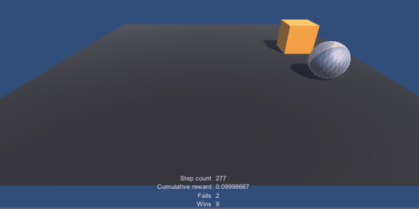
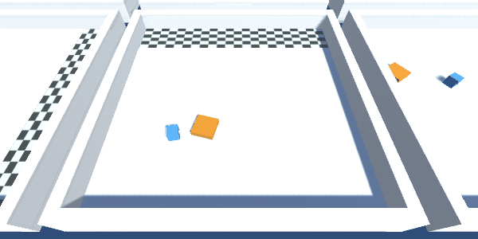
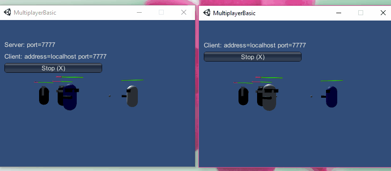

## Small games and experiences developed in Unity3D.

* MLAgents Crawler - a creature with 4 legs and 4 forelegs which has to move its body towards the target. The legs, forelegs and body are connected using configurable joints.
The agent collects observations related to  position, rotation, velocity, and angular velocities of each leg, foreleg and body. The agent is rewarded when it gets closer to the target, when is facing the target and when it touches the target.
In the first training session the agent it is free to find a way to move towards the target.

In the second training session, the agents gets a penalty if the upper leg (the white one) touches the ground.

* MLAgents Reacher Arm - using Reinforcement Learning with [MLAgents](https://github.com/Unity-Technologies/ml-agents) Toolkit to train a double jointed arm to move it's hand to goal location and keep it there.
The agent collects observations related to position, rotation, velocity and angular velocity of the upper and lower arm. He is rewarded each time when the hand is in goal location.

* ARCorePortal - an Augmented Reality Portal based on the series [How To Unity AR Portal](https://www.youtube.com/playlist?list=PLKIKuXdn4ZMhwJmPnYI0e7Ixv94ZFPvEP) using Stencil buffer

* ARCoreSnake - an Augmented Reality Snake game based on [Google CodeLabs Tutorial](https://codelabs.developers.google.com/codelabs/arcore-intro/index.html?index=..%2F..io2018#0)
    * Enabling ARCore through the Player settings
    * Adding the ARCore SDK prefabs to the scene
    * Scaling objects consistently to look reasonable with respect to the real world.
    * Using Anchors to place objects at a fixed location relative to the real world.
    * Using detected planes as the foundation of augmented reality objects
    * Using touch and gaze input to interact with the ARCore scene
	
* AWSSamples - a proof of concept how to access AWS S3 and DynamoDB and how to use AWS Cognito

* AudioSpectrumVisualization - visualizer for audio spectrum data

* CharacterAnimator - create a character in Blender(Model, UV Mapping, Texture, Rigging, Animation) and use Animator controller in Unity3D

* DaydreamGrabReleaseSphere	- a VR tutorial of handling a sphere object for DayDream
* DaydreamPickingPushing - Picking, Pushing and Throwing with Daydream Controller [Google CodeLabs Tutorial](https://codelabs.developers.google.com/codelabs/daydream-picking-pushing/index.html?index=..%2F..%2Findex#0)
    * Create a new Unity project that uses the Google VR Unity SDK.    
    * How to adjust the build settings to target Daydream devices.
    * Deploy a Daydream app onto a device.
    * Create a highlighting component that will notify the user when objects can be interacted with.
    * Create pushable buttons that will control and fire a cannon.
    

* EndlessRunner

* HorrorApartment

* LyndaTown - Creating a Game Environment in Blender and Unity based on [Lynda Tutorial](https://www.lynda.com/Blender-tutorials/Creating-Game-Environment-Blender/380259-2.html)
    * Testing the scale
    * Modeling buildings and pipes
    * Creating walkways
    * UV mapping
    * Creating textures
    * Importing the scene in Unity
* MLAgentsRollerBall - using Reinforcement Learning with [MLAgents](https://github.com/Unity-Technologies/ml-agents) Toolkit to train an agent(Ball) to touch a target (Cube) without falling from the platform

* MLAgents - using Reinforcement Learning with [MLAgents](https://github.com/Unity-Technologies/ml-agents) Toolkit to train an agent(BlueCube) to push a target (OrangeCube) to a Goal area

* Minecraft - a procedurally generated Minecraft game

* MultiplayerBasic - a proof of concept for a multiplayer game using UnityEngine.Networking

* Pinball
* ProceduralCity
* RPGKnight
* Roll a Ball
* Service Adjustmend App
* ShaderGraphDissolve
* SideScrollingSpaceShip

* SimpleRPG
* Space Shooter
* SurvivalShooter - an isometric 3D survival shooter game.
Based on the [Survival Shooter](https://unity3d.com/learn/tutorials/s/survival-shooter-tutorial) from Unity

* TalkingCube
* Tanks - a 2 player (one keyboard) shooter game with simple game mechanics, integrating world and screen space UI, as well as game architecture and audio mixing.
Based on [Tanks](https://unity3d.com/learn/tutorials/s/tanks-tutorial) tutorial from Unity3D

* TowerDefense - a tower defense game with machine, missle and laser gun

* Unity 3D RTS
* UnrealTournment

