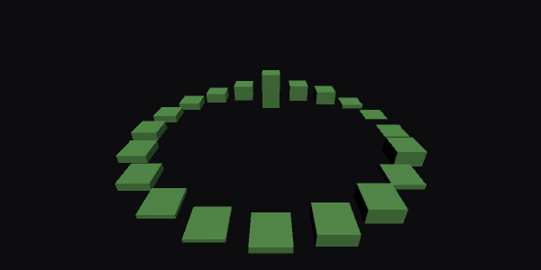
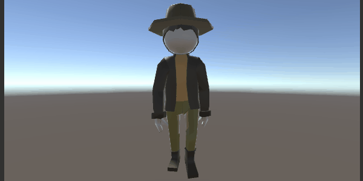

## Small games and experiences developed Unity3D.
* ARCorePortal - an Augmented Reality Portal based on the series [How To Unity AR Portal](https://www.youtube.com/playlist?list=PLKIKuXdn4ZMhwJmPnYI0e7Ixv94ZFPvEP) using Stencil buffer
* ARCoreSnake - an Augmented Reality Snake game based on [Google CodeLabs Tutorial](https://codelabs.developers.google.com/codelabs/arcore-intro/index.html?index=..%2F..io2018#0)
    * Enabling ARCore through the Player settings
    * Adding the ARCore SDK prefabs to the scene
    * Scaling objects consistently to look reasonable with respect to the real world.
    * Using Anchors to place objects at a fixed location relative to the real world.
    * Using detected planes as the foundation of augmented reality objects
    * Using touch and gaze input to interact with the ARCore scene
* AWSSamples - a proof of concept how to access AWS S3 and DynamoDB and how to use AWS Cognito
* AudioSpectrumVisualization - visualizer for audio spectrum data

* CharacterAnimator - create a character in Blender(Model, UV Mapping, Texture, Rigging, Animation) and use Animator controller in Unity3D

* DaydreamGrabReleaseSphere	- a VR tutorial of handling a sphere object for DayDream
* DaydreamPickingPushing - Picking, Pushing and Throwing with Daydream Controller [Google CodeLabs Tutorial](https://codelabs.developers.google.com/codelabs/daydream-picking-pushing/index.html?index=..%2F..%2Findex#0)
    * Create a new Unity project that uses the Google VR Unity SDK.    
    * How to adjust the build settings to target Daydream devices.
    * Deploy a Daydream app onto a device.
    * Create a highlighting component that will notify the user when objects can be interacted with.
    * Create pushable buttons that will control and fire a cannon.
    

* EndlessRunner

* HorrorApartment
* LyndaTown
* MLAgentsRollerBall
* Minecraft
* MultiplayerBasic
* Pinball
* ProceduralCity
* RPGKnight
* Roll a Ball
* Service Adjustmend App
* ShaderGraphDissolve
* SideScrollingSpaceShip
* SimpleRPG
* Space Shooter
* SurvivalShooter
* TalkingCube
* Tanks
* TowerDefense
* Unity 3D RTS
* UnrealTournment

